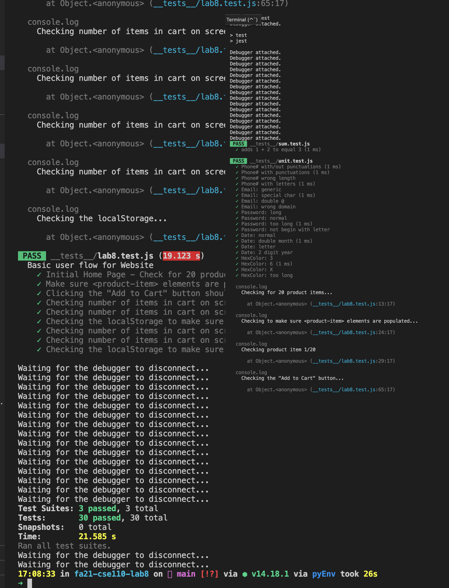

# Lab 8 - Starter

NO PARTNERS.

## Answer to Questions

### Q1

In your own words: Where would you fit your automated tests in your Recipe project development pipeline?

    All three are needed. We want to keep code in repo as clean as possible. Local testing speeds up production, remote testing forces good software engineering pratices and keeps codebase clean. Final testing ensures stability and usability of the product.

### Q2

Would you use an end to end test to check if a function is returning the correct output?

    No. That is for unit testing.

### Q3

Would you use a unit test to test the “message” feature of a messaging application? Why or why not? For this question, assume the “message” feature allows a user to write and send a message to another user.

    This is not a good feature to test because "message" is not a "unit." It consists of writing, sending, and receiving, and combining all three at once breaks the idea of a unit test.

### Q4

Would you use a unit test to test the “max message length” feature of a messaging application? Why or why not? For this question, assume the “max message length” feature prevents the user from typing more than 80 characters.

    This is good to test for unit tests because it is an atomic feature and can be tested easily.

## Screenshut

